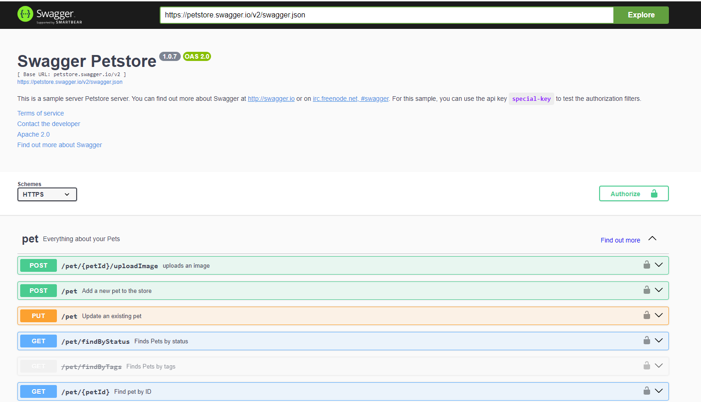
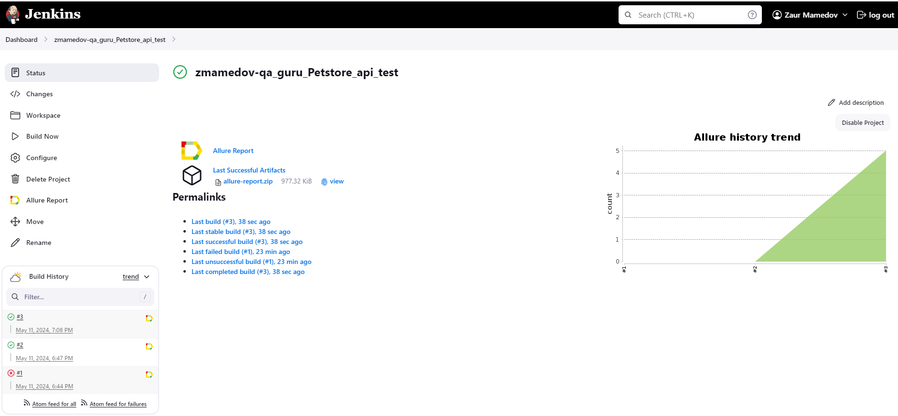
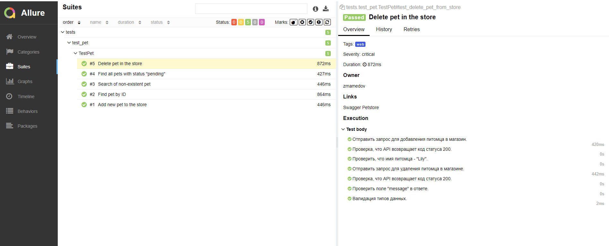
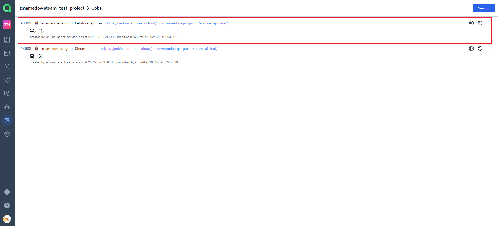
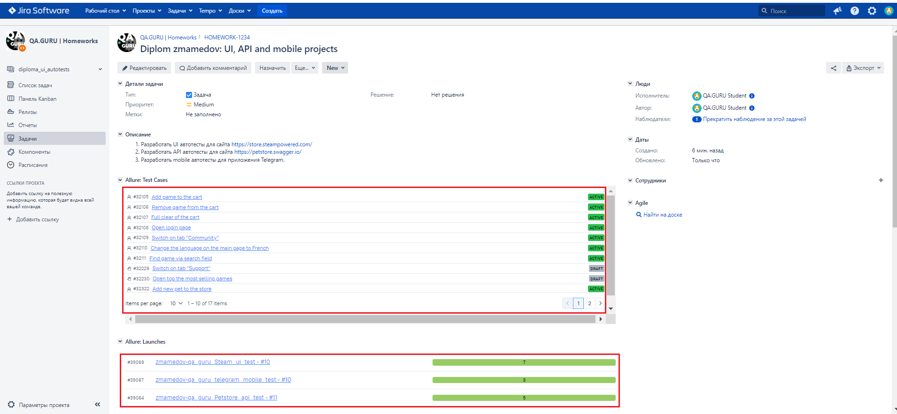
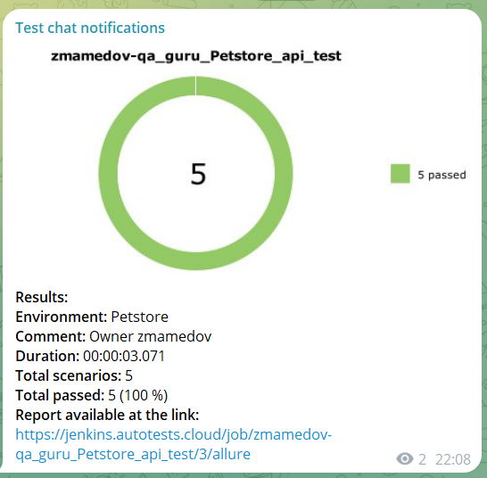

# Проект по тестированию API Petstore

><a target="_blank" href="https://petstore.swagger.io/">Swagger Petstore</a>
> 

---
### Список проверок, реализованных в автотестах
1. Создание одного питомца.
2. Поиск питомца по ID.
3. Поиск несуществующего питомца.
4. Поиск всех питомцев по указанному статусу.
5. Удаление питомца.

---

### Используемые инструменты
         

---

### Запуск автотестов осуществляется с использованием Jenkins
> [Ссылка на сборку в Jenkins](https://jenkins.autotests.cloud/job/zmamedov-qa_guru_Petstore_api_test/)

#### Для запуска автотестов в Jenkins
1. Открыть [задачу в Jenkins](https://jenkins.autotests.cloud/job/zmamedov-qa_guru_Petstore_api_test/)

2. Нажать "**Build Now**".

---

### Allure отчет

---

### Интеграция с Allure TestOps

> [Job #3989 zmamedov-qa_guru_Petstore_api_test](https://allure.autotests.cloud/project/4223/jobs)

---

### Интеграция с Jira
> [Задача в Jira](https://jira.autotests.cloud/browse/HOMEWORK-1234)
 

---

### Уведомления в Телеграм

